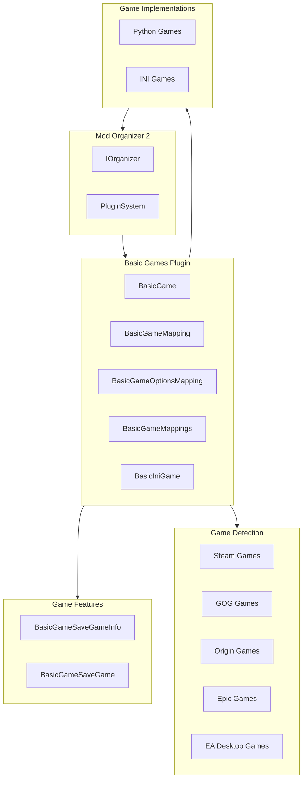
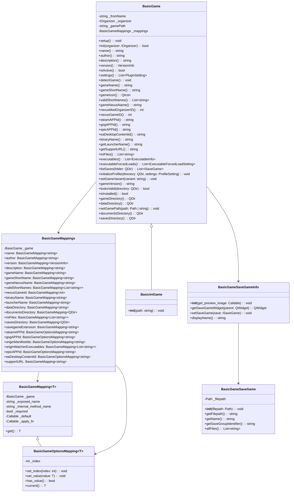
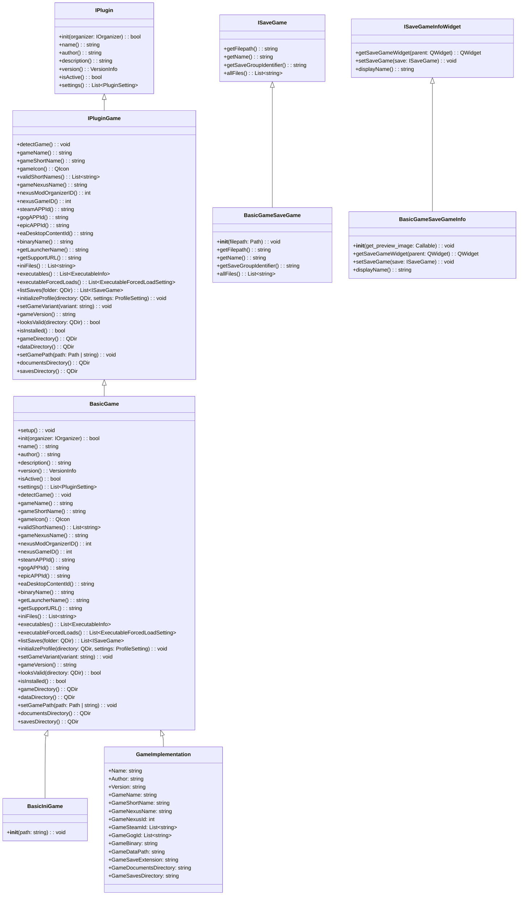
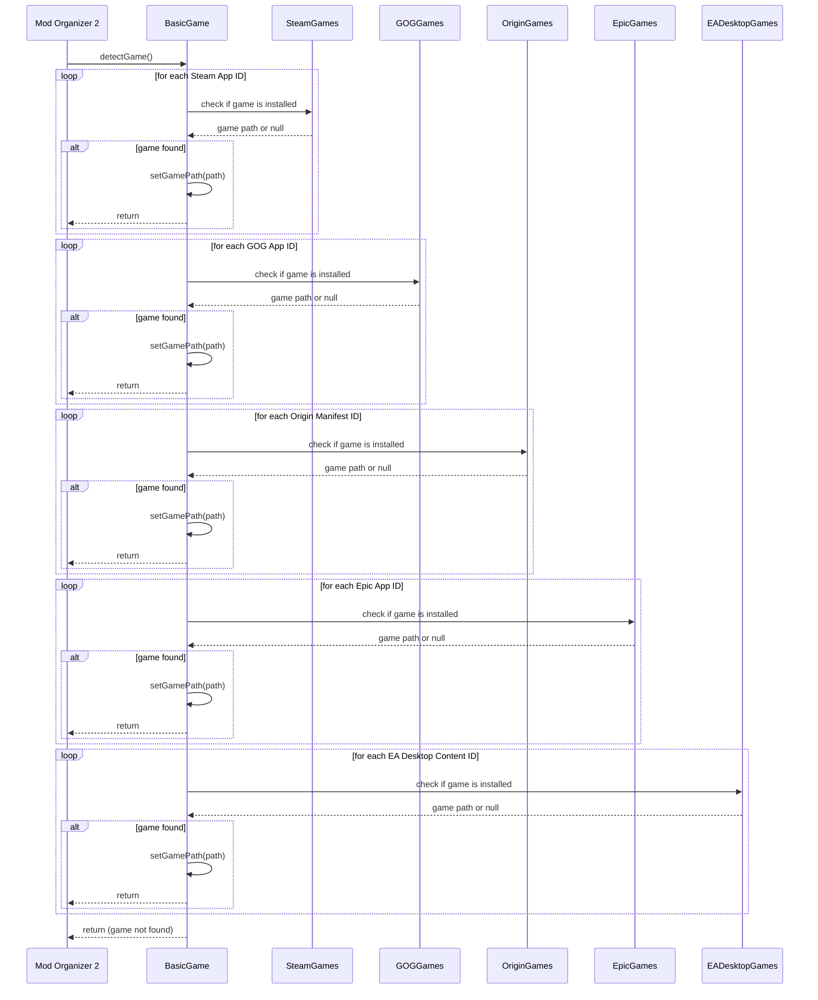
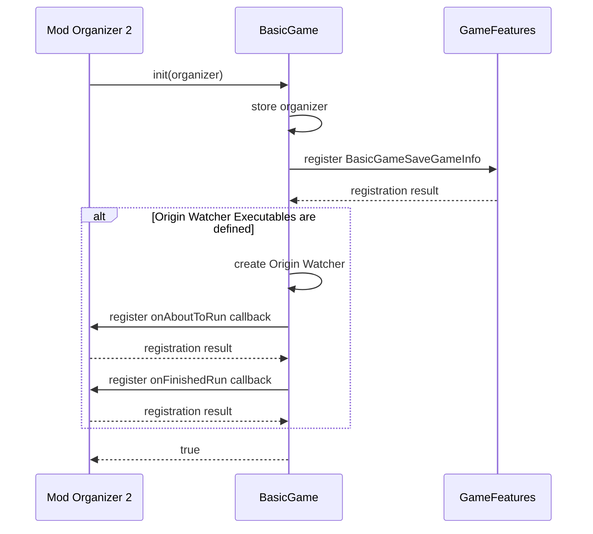
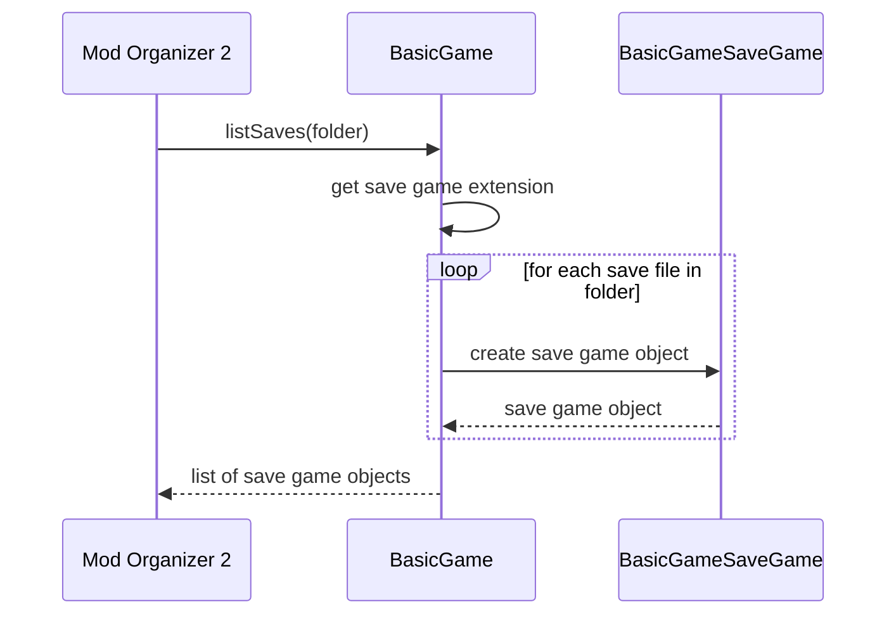
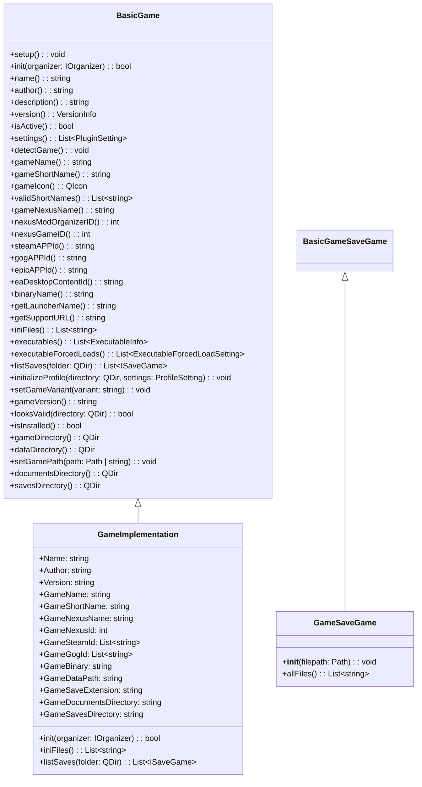
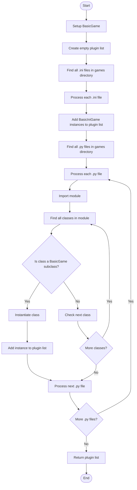

# Basic Games Plugin Diagrams

This document provides visual diagrams of the architecture and relationships of the Basic Games plugin for Mod Organizer 2.

## Table of Contents

- [Basic Games Plugin Diagrams](#basic-games-plugin-diagrams)
  - [Table of Contents](#table-of-contents)
  - [Plugin Architecture](#plugin-architecture)
  - [Component Relationships](#component-relationships)
  - [Plugin Inheritance](#plugin-inheritance)
  - [Game Detection Process](#game-detection-process)
  - [Game Initialization Process](#game-initialization-process)
  - [Save Game Handling](#save-game-handling)
  - [Game Implementation](#game-implementation)
  - [Plugin Registration](#plugin-registration)

## Plugin Architecture

The following diagram shows the overall architecture of the Basic Games plugin:

## Component Relationships

The following diagram shows the relationships between the components of the Basic Games plugin:

## Plugin Inheritance

The following diagram shows the inheritance hierarchy of the Basic Games plugin:

## Game Detection Process

The following sequence diagram shows the game detection process of the Basic Games plugin:

## Game Initialization Process

The following sequence diagram shows the game initialization process of the Basic Games plugin:

## Save Game Handling

The following sequence diagram shows the save game handling process of the Basic Games plugin:

## Game Implementation

The following diagram shows the structure of a game implementation:

## Plugin Registration

The following flowchart shows the plugin registration process of the Basic Games plugin:

These diagrams should help visualize the architecture and relationships of the Basic Games plugin for Mod Organizer 2.
