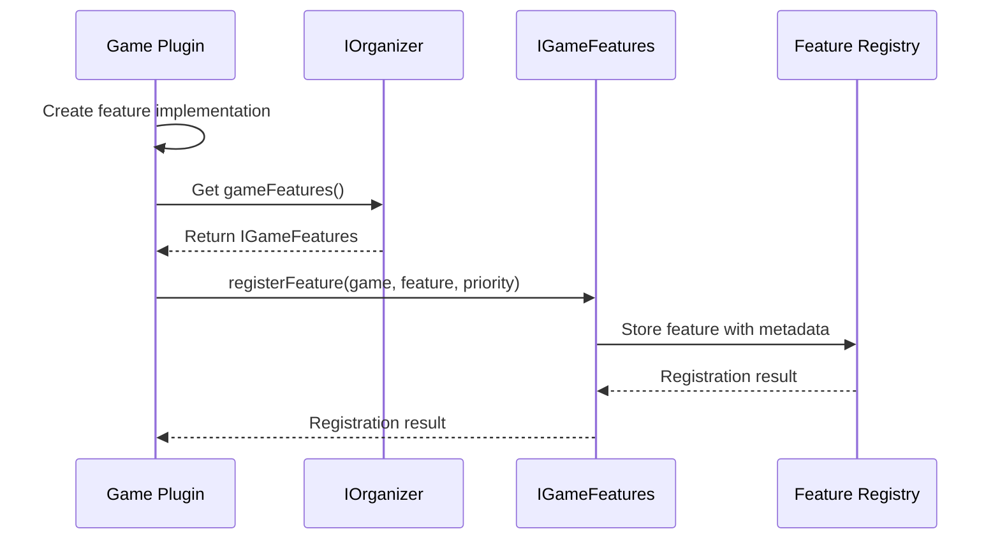
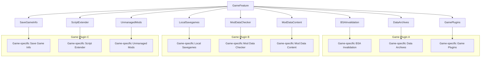
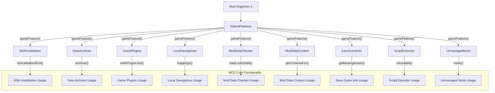
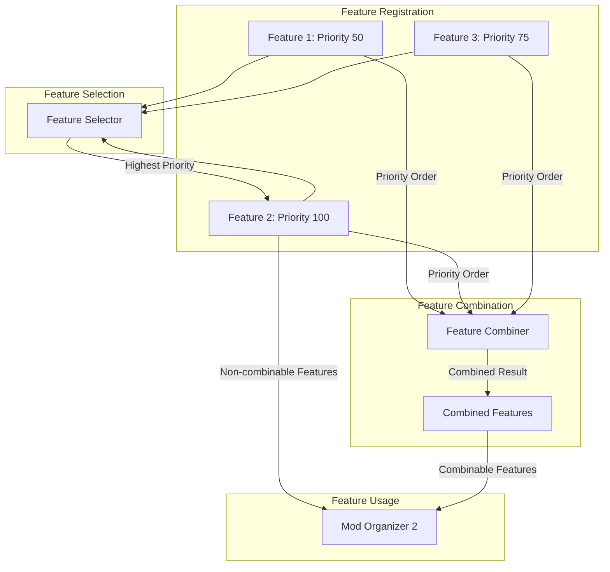

# MO2 Game Features Diagrams

This document provides visual representations of the MO2 Game Features system to help understand its architecture and relationships.

## Table of Contents

- [MO2 Game Features Diagrams](#mo2-game-features-diagrams)
  - [Table of Contents](#table-of-contents)
  - [Class Hierarchy](#class-hierarchy)
  - [Game Features Registration](#game-features-registration)
  - [Feature Type Relationships](#feature-type-relationships)
  - [Feature Interaction with MO2](#feature-interaction-with-mo2)
  - [Feature Priority and Overriding](#feature-priority-and-overriding)
  - [Game Feature Implementation Example](#game-feature-implementation-example)

## Class Hierarchy

```mermaid
classDiagram
    class GameFeature {
        <<abstract>>
        +virtual ~GameFeature() = 0
        +virtual const std::type_info& typeInfo() const = 0
    }
    
    class GameFeatureCRTP~T~ {
        +const std::type_info& typeInfo() const
    }
    
    GameFeature <|-- GameFeatureCRTP
    
    class BSAInvalidation {
        <<interface>>
        +bool isInvalidationBSA(const QString& bsaName)
        +void deactivate(IProfile* profile)
        +void activate(IProfile* profile)
        +bool prepareProfile(IProfile* profile)
    }
    
    class DataArchives {
        <<interface>>
        +QStringList vanillaArchives() const
        +QStringList archives(const IProfile* profile) const
        +void addArchive(IProfile* profile, int index, const QString& archiveName)
        +void removeArchive(IProfile* profile, const QString& archiveName)
    }
    
    class GamePlugins {
        <<interface>>
        +void writePluginLists(const IPluginList* pluginList)
        +void readPluginLists(IPluginList* pluginList)
        +QStringList getLoadOrder()
        +bool lightPluginsAreSupported()
        +bool mediumPluginsAreSupported()
        +bool blueprintPluginsAreSupported()
    }
    
    class LocalSavegames {
        <<interface>>
        +MappingType mappings(const QDir& profileSaveDir) const
        +bool prepareProfile(IProfile* profile)
    }
    
    class ModDataChecker {
        <<interface>>
        +enum CheckReturn
        +CheckReturn dataLooksValid(std::shared_ptr~const IFileTree~ fileTree) const
        +std::shared_ptr~IFileTree~ fix(std::shared_ptr~IFileTree~ fileTree) const
    }
    
    class ModDataContent {
        <<interface>>
        +struct Content
        +std::vector~Content~ getAllContents() const
        +std::vector~int~ getContentsFor(std::shared_ptr~const IFileTree~ fileTree) const
    }
    
    class SaveGameInfo {
        <<interface>>
        +typedef QStringList ProvidingModules
        +typedef QMap~QString, ProvidingModules~ MissingAssets
        +MissingAssets getMissingAssets(ISaveGame const& save) const
        +ISaveGameInfoWidget* getSaveGameWidget(QWidget* parent) const
    }
    
    class ScriptExtender {
        <<interface>>
        +QString BinaryName() const
        +QString PluginPath() const
        +QString loaderName() const
        +QString loaderPath() const
        +QString savegameExtension() const
        +bool isInstalled() const
        +QString getExtenderVersion() const
        +WORD getArch() const
    }
    
    class UnmanagedMods {
        <<interface>>
        +QStringList mods(bool onlyOfficial) const
        +QString displayName(const QString& modName) const
        +QFileInfo referenceFile(const QString& modName) const
        +QStringList secondaryFiles(const QString& modName) const
    }
    
    GameFeatureCRTP <|-- BSAInvalidation
    GameFeatureCRTP <|-- DataArchives
    GameFeatureCRTP <|-- GamePlugins
    GameFeatureCRTP <|-- LocalSavegames
    GameFeatureCRTP <|-- ModDataChecker
    GameFeatureCRTP <|-- ModDataContent
    GameFeatureCRTP <|-- SaveGameInfo
    GameFeatureCRTP <|-- ScriptExtender
    GameFeatureCRTP <|-- UnmanagedMods
```



## Game Features Registration



## Feature Type Relationships



## Feature Interaction with MO2



## Feature Priority and Overriding



## Game Feature Implementation Example

```mermaid
classDiagram
    class BSAInvalidation {
        <<interface>>
        +bool isInvalidationBSA(const QString& bsaName)
        +void deactivate(IProfile* profile)
        +void activate(IProfile* profile)
        +bool prepareProfile(IProfile* profile)
    }
    
    class SkyrimBSAInvalidation {
        +bool isInvalidationBSA(const QString& bsaName)
        +void deactivate(IProfile* profile)
        +void activate(IProfile* profile)
        +bool prepareProfile(IProfile* profile)
    }
    
    class FalloutBSAInvalidation {
        +bool isInvalidationBSA(const QString& bsaName)
        +void deactivate(IProfile* profile)
        +void activate(IProfile* profile)
        +bool prepareProfile(IProfile* profile)
    }
    
    BSAInvalidation <|-- SkyrimBSAInvalidation
    BSAInvalidation <|-- FalloutBSAInvalidation
    
    class GamePlugins {
        <<interface>>
        +void writePluginLists(const IPluginList* pluginList)
        +void readPluginLists(IPluginList* pluginList)
        +QStringList getLoadOrder()
        +bool lightPluginsAreSupported()
    }
    
    class SkyrimGamePlugins {
        +void writePluginLists(const IPluginList* pluginList)
        +void readPluginLists(IPluginList* pluginList)
        +QStringList getLoadOrder()
        +bool lightPluginsAreSupported()
    }
    
    class FalloutGamePlugins {
        +void writePluginLists(const IPluginList* pluginList)
        +void readPluginLists(IPluginList* pluginList)
        +QStringList getLoadOrder()
        +bool lightPluginsAreSupported()
    }
    
    GamePlugins <|-- SkyrimGamePlugins
    GamePlugins <|-- FalloutGamePlugins
