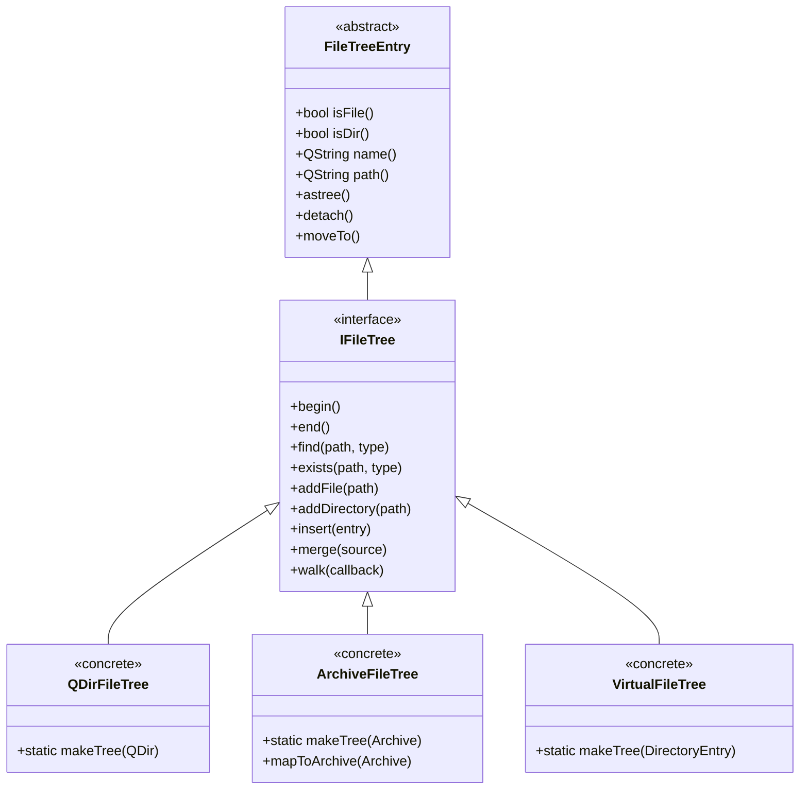
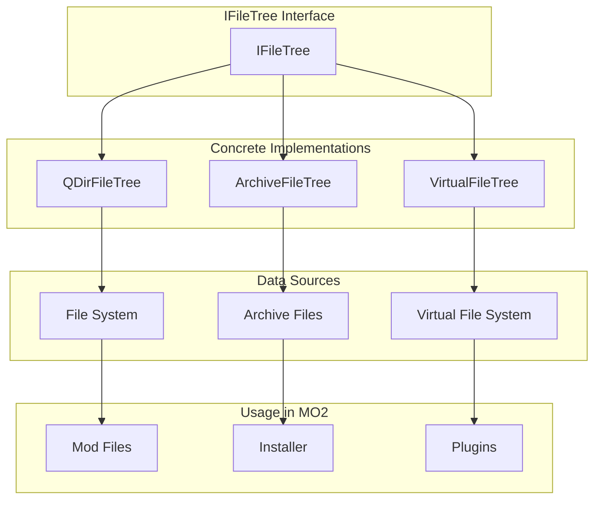
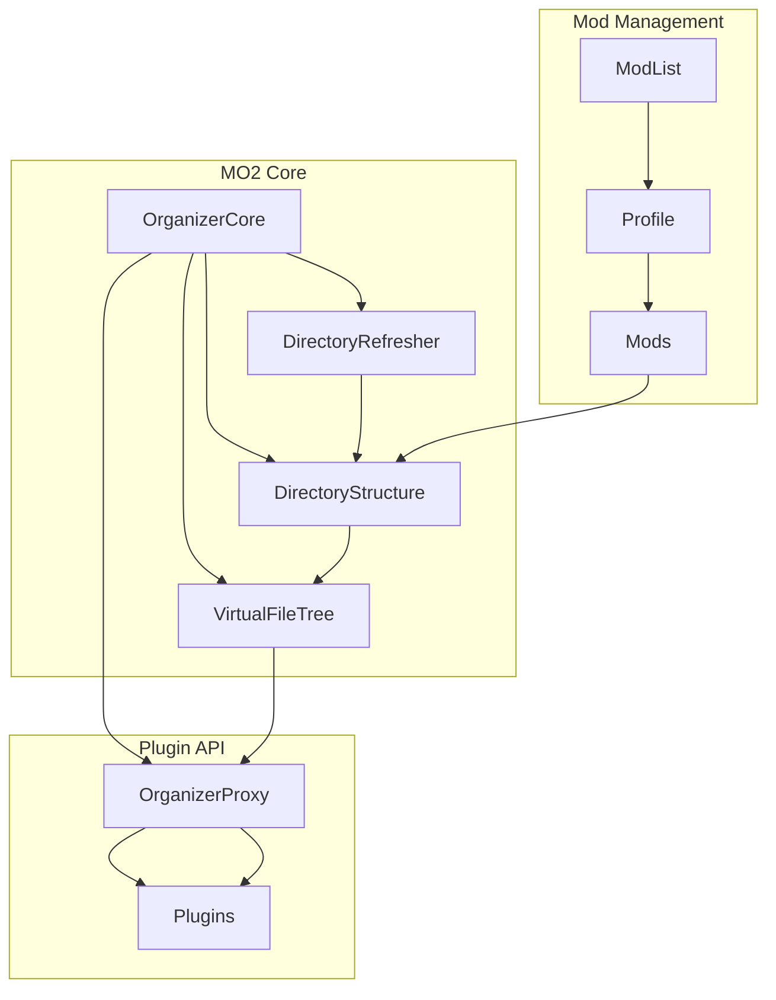
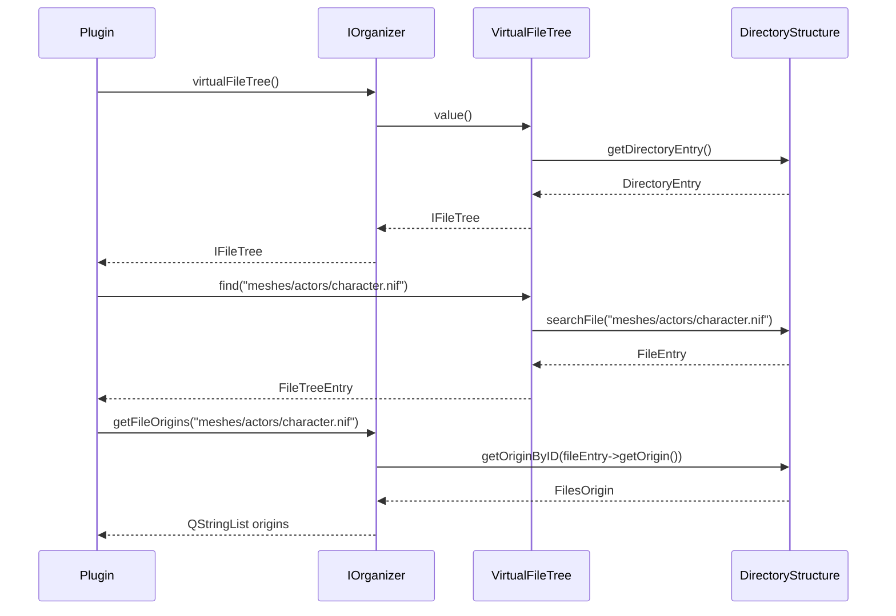
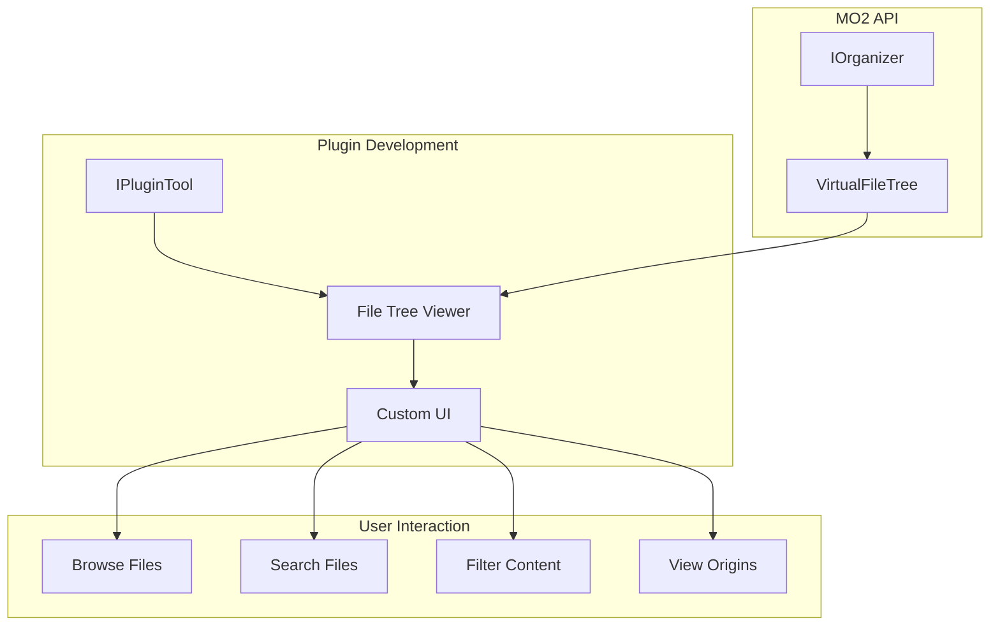
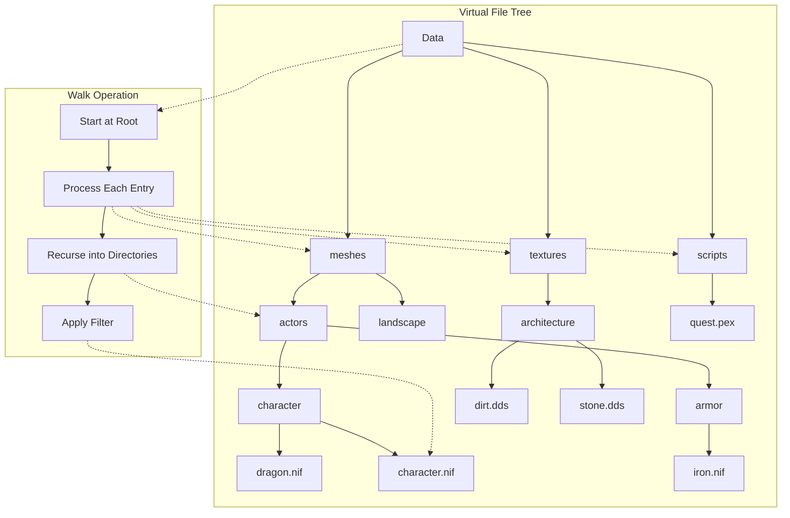

# MO2 File Tree System Diagrams

This document provides visual representations of the file tree system in Mod Organizer 2, complementing the detailed explanations in [FILE_TREE_DETAILS.md](FILE_TREE_DETAILS.md).

## Table of Contents

- [MO2 File Tree System Diagrams](#mo2-file-tree-system-diagrams)
  - [Table of Contents](#table-of-contents)
  - [Class Hierarchy](#class-hierarchy)
  - [File Tree Implementations](#file-tree-implementations)
  - [Virtual File System Architecture](#virtual-file-system-architecture)
  - [File Tree Operations](#file-tree-operations)
  - [Plugin Integration](#plugin-integration)
  - [File Tree Traversal Example](#file-tree-traversal-example)
  - [Combining Physical and Virtual Trees](#combining-physical-and-virtual-trees)

## Class Hierarchy



## File Tree Implementations



## Virtual File System Architecture



## File Tree Operations



## Plugin Integration



## File Tree Traversal Example



## Combining Physical and Virtual Trees

```mermaid
graph TD
    subgraph "Physical File System"
        PFS[Physical Files]
        PDATA[Data Directory]
        PBASE[Base Game Files]
        PDLC[DLC Files]
    end
    
    subgraph "Virtual File System"
        VFS[Virtual Files]
        VMODS[Mod Files]
        VOVER[Overwrite Files]
    end
    
    subgraph "Combined View"
        CV[Combined View]
        MERGED[Merged Files]
        CONFLICTS[Conflict Resolution]
    end
    
    PFS --> PDATA
    PDATA --> PBASE
    PDATA --> PDLC
    
    VFS --> VMODS
    VFS --> VOVER
    
    PDATA --> CV
    VFS --> CV
    
    CV --> MERGED
    CV --> CONFLICTS
    
    subgraph "User Interface"
        TREE[Tree View]
        LIST[List View]
        DETAILS[Details View]
    end
    
    CV --> TREE
    CV --> LIST
    CV --> DETAILS
