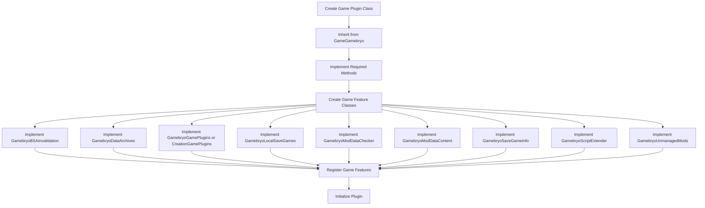
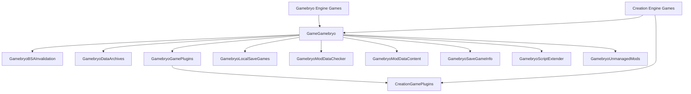

# Mod Organizer 2 Gamebryo Support Diagrams

This document provides visual diagrams of the classes and their relationships in the Mod Organizer 2 Gamebryo support library.

## Class Hierarchy

The following diagram shows the inheritance hierarchy of the classes in the Gamebryo support library:

```mermaid
classDiagram
    IPluginGame <|-- GameGamebryo
    IPluginFileMapper <|-- GameGamebryo
    
    BSAInvalidation <|-- GamebryoBSAInvalidation
    DataArchives <|-- GamebryoDataArchives
    GamePlugins <|-- GamebryoGamePlugins
    GamePlugins <|-- CreationGamePlugins
    GamebryoGamePlugins <|-- CreationGamePlugins
    LocalSavegames <|-- GamebryoLocalSaveGames
    ModDataChecker <|-- GamebryoModDataChecker
    ModDataContent <|-- GamebryoModDataContent
    ISaveGame <|-- GamebryoSaveGame
    SaveGameInfo <|-- GamebryoSaveGameInfo
    ScriptExtender <|-- GamebryoScriptExtender
    UnmanagedMods <|-- GamebryoUnmanagedMods
    
    class GameGamebryo {
        +detectGame()
        +init(MOBase::IOrganizer* moInfo)
        +isInstalled() const
        +gameDirectory() const
        +dataDirectory() const
        +setGamePath(const QString& path)
        +documentsDirectory() const
        +savesDirectory() const
        +gameVersion() const
        +getLauncherName() const
        +mappings() const
        #savegameExtension() const
        #savegameSEExtension() const
        #makeSaveGame(QString filepath) const
        #identifyGamePath() const
        #prepareIni(const QString& exec)
        #registerFeature(std::shared_ptr<MOBase::GameFeature> feature)
    }
    
    class GamebryoBSAInvalidation {
        +isInvalidationBSA(const QString& bsaName)
        +deactivate(MOBase::IProfile* profile)
        +activate(MOBase::IProfile* profile)
        +prepareProfile(MOBase::IProfile* profile)
        #invalidationBSAName() const
        #bsaVersion() const
    }
    
    class GamebryoDataArchives {
        +addArchive(MOBase::IProfile* profile, int index, const QString& archiveName)
        +removeArchive(MOBase::IProfile* profile, const QString& archiveName)
        #gameDirectory() const
        #localGameDirectory() const
        #getArchivesFromKey(const QString& iniFile, const QString& key, int size) const
        #setArchivesToKey(const QString& iniFile, const QString& key, const QString& value)
        #writeArchiveList(MOBase::IProfile* profile, const QStringList& before)
    }
    
    class GamebryoGamePlugins {
        +writePluginLists(const MOBase::IPluginList* pluginList)
        +readPluginLists(MOBase::IPluginList* pluginList)
        +getLoadOrder()
        #writePluginList(const MOBase::IPluginList* pluginList, const QString& filePath)
        #writeLoadOrderList(const MOBase::IPluginList* pluginList, const QString& filePath)
        #readLoadOrderList(MOBase::IPluginList* pluginList, const QString& filePath)
        #readPluginList(MOBase::IPluginList* pluginList)
    }
    
    class CreationGamePlugins {
        +writePluginList(const MOBase::IPluginList* pluginList, const QString& filePath)
        +readPluginList(MOBase::IPluginList* pluginList)
        +getLoadOrder()
        +lightPluginsAreSupported()
    }
    
    class GamebryoLocalSaveGames {
        +mappings(const QDir& profileSaveDir) const
        +prepareProfile(MOBase::IProfile* profile)
    }
    
    class GamebryoModDataChecker {
        +dataLooksValid(std::shared_ptr<const MOBase::IFileTree> fileTree) const
        +fix(std::shared_ptr<MOBase::IFileTree> fileTree) const
    }
    
    class GamebryoModDataContent {
        +getAllContents() const
        +getContentsFor(std::shared_ptr<const MOBase::IFileTree> fileTree) const
    }
    
    class GamebryoSaveGame {
        +getCreationTime() const
        +getFilename() const
        +getSaveGroupIdentifier() const
        +allFiles() const
    }
    
    class GamebryoSaveGameInfo {
        +getMissingAssets(MOBase::ISaveGame const& save) const
        +getSaveGameWidget(QWidget* parent) const
    }
    
    class GamebryoScriptExtender {
        +BinaryName() const
        +PluginPath() const
        +loaderName() const
        +loaderPath() const
        +savegameExtension() const
        +isInstalled() const
        +getExtenderVersion() const
        +getArch() const
    }
    
    class GamebryoUnmanagedMods {
        +mods(bool onlyOfficial) const
        +displayName(const QString& modName) const
        +referenceFile(const QString& modName) const
        +secondaryFiles(const QString& modName) const
    }
```

## Relationship with UI Base

The following diagram shows how the Gamebryo support library extends the UI Base interfaces:

```mermaid
classDiagram
    IPluginGame <|-- GameGamebryo
    IPluginFileMapper <|-- GameGamebryo
    
    GameFeature <|-- BSAInvalidation
    GameFeature <|-- DataArchives
    GameFeature <|-- GamePlugins
    GameFeature <|-- LocalSavegames
    GameFeature <|-- ModDataChecker
    GameFeature <|-- ModDataContent
    GameFeature <|-- SaveGameInfo
    GameFeature <|-- ScriptExtender
    GameFeature <|-- UnmanagedMods
    
    BSAInvalidation <|-- GamebryoBSAInvalidation
    DataArchives <|-- GamebryoDataArchives
    GamePlugins <|-- GamebryoGamePlugins
    LocalSavegames <|-- GamebryoLocalSaveGames
    ModDataChecker <|-- GamebryoModDataChecker
    ModDataContent <|-- GamebryoModDataContent
    SaveGameInfo <|-- GamebryoSaveGameInfo
    ScriptExtender <|-- GamebryoScriptExtender
    UnmanagedMods <|-- GamebryoUnmanagedMods
    
    class IPluginGame {
        +gameName() const
        +initializeProfile(const QDir& directory, ProfileSettings settings) const
        +isInstalled() const
        +gameDirectory() const
        +dataDirectory() const
        +documentsDirectory() const
        +savesDirectory() const
        +...()
    }
    
    class IPluginFileMapper {
        +mappings() const
    }
    
    class GameFeature {
        +typeInfo() const
    }
    
    class BSAInvalidation {
        +isInvalidationBSA(const QString& bsaName)
        +deactivate(MOBase::IProfile* profile)
        +activate(MOBase::IProfile* profile)
        +prepareProfile(MOBase::IProfile* profile)
    }
    
    class DataArchives {
        +vanillaArchives() const
        +archives(const MOBase::IProfile* profile) const
        +addArchive(MOBase::IProfile* profile, int index, const QString& archiveName)
        +removeArchive(MOBase::IProfile* profile, const QString& archiveName)
    }
    
    class GamePlugins {
        +writePluginLists(const MOBase::IPluginList* pluginList)
        +readPluginLists(MOBase::IPluginList* pluginList)
        +getLoadOrder()
        +lightPluginsAreSupported()
        +mediumPluginsAreSupported()
        +blueprintPluginsAreSupported()
    }
    
    class LocalSavegames {
        +mappings(const QDir& profileSaveDir) const
        +prepareProfile(MOBase::IProfile* profile)
    }
    
    class ModDataChecker {
        +dataLooksValid(std::shared_ptr<const MOBase::IFileTree> fileTree) const
        +fix(std::shared_ptr<MOBase::IFileTree> fileTree) const
    }
    
    class ModDataContent {
        +getAllContents() const
        +getContentsFor(std::shared_ptr<const MOBase::IFileTree> fileTree) const
    }
    
    class SaveGameInfo {
        +getMissingAssets(MOBase::ISaveGame const& save) const
        +getSaveGameWidget(QWidget* parent) const
    }
    
    class ScriptExtender {
        +BinaryName() const
        +PluginPath() const
        +loaderName() const
        +loaderPath() const
        +savegameExtension() const
        +isInstalled() const
        +getExtenderVersion() const
        +getArch() const
    }
    
    class UnmanagedMods {
        +mods(bool onlyOfficial) const
        +displayName(const QString& modName) const
        +referenceFile(const QString& modName) const
        +secondaryFiles(const QString& modName) const
    }
```

## Game Plugin Implementation Flow

The following diagram shows the typical flow for implementing a game plugin using the Gamebryo support library:

## Creation vs Gamebryo

The following diagram shows the relationship between the Gamebryo and Creation Engine implementations:

These diagrams should help visualize the relationships between the different classes in the Gamebryo support library and how they extend the UI Base interfaces.
