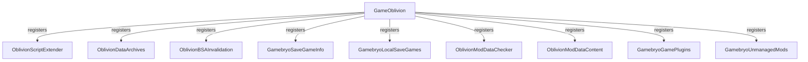
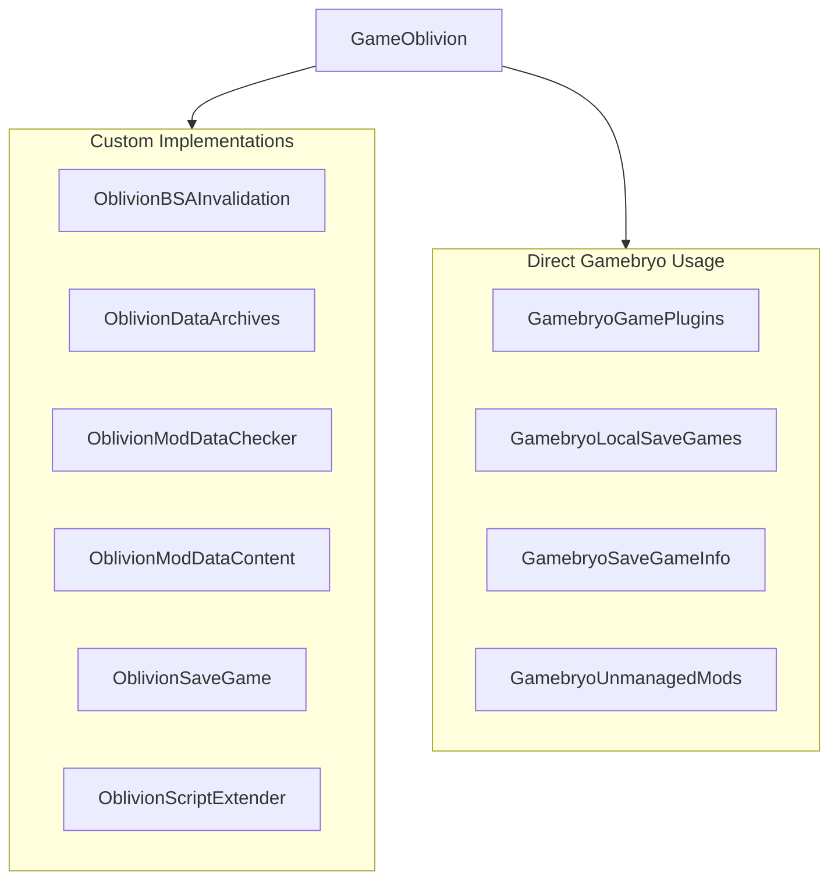
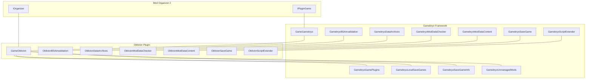
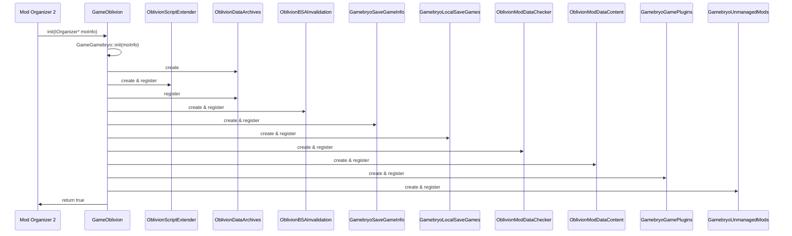

# Mod Organizer 2 Oblivion Plugin Diagrams

This document provides visual diagrams of the classes and their relationships in the Mod Organizer 2 Oblivion plugin.

## Class Hierarchy

The following diagram shows the inheritance hierarchy of the classes in the Oblivion plugin:

```mermaid
classDiagram
    GameGamebryo <|-- GameOblivion
    
    GamebryoBSAInvalidation <|-- OblivionBSAInvalidation
    GamebryoDataArchives <|-- OblivionDataArchives
    GamebryoModDataChecker <|-- OblivionModDataChecker
    GamebryoModDataContent <|-- OblivionModDataContent
    GamebryoSaveGame <|-- OblivionSaveGame
    GamebryoScriptExtender <|-- OblivionScriptExtender
    
    class GameOblivion {
        +init(IOrganizer* moInfo)
        +gameName() const
        +executables() const
        +executableForcedLoads() const
        +initializeProfile(const QDir& path, ProfileSettings settings) const
        +steamAPPId() const
        +primaryPlugins() const
        +gameShortName() const
        +validShortNames() const
        +gameNexusName() const
        +iniFiles() const
        +DLCPlugins() const
        +savegameExtension() const
        +savegameSEExtension() const
        +makeSaveGame(QString filePath) const
    }
    
    class OblivionBSAInvalidation {
        +invalidationBSAName() const
        +bsaVersion() const
    }
    
    class OblivionDataArchives {
        +vanillaArchives() const
        +archives(const MOBase::IProfile* profile) const
        +writeArchiveList(MOBase::IProfile* profile, const QStringList& before)
    }
    
    class OblivionModDataChecker {
        +dataLooksValid(std::shared_ptr<const MOBase::IFileTree> fileTree) const
        +fix(std::shared_ptr<MOBase::IFileTree> fileTree) const
        +possibleFolderNames() const
        +possibleFileExtensions() const
    }
    
    class OblivionModDataContent {
        -m_Enabled[CONTENT_MCM] = false
        -m_Enabled[CONTENT_SKYPROC] = false
    }
    
    class OblivionSaveGame {
        +fetchInformationFields(FileWrapper& wrapper, unsigned long& saveNumber, QString& playerName, unsigned short& playerLevel, QString& playerLocation, SYSTEMTIME& creationTime) const
        +fetchDataFields() const
    }
    
    class OblivionScriptExtender {
        +BinaryName() const
        +PluginPath() const
    }
```

## Feature Registration

The following diagram shows how the game features are registered in the Oblivion plugin:

## Custom vs. Direct Gamebryo Features

The following diagram shows which features are implemented specifically for Oblivion and which are used directly from the Gamebryo framework:

## Oblivion Plugin Architecture

The following diagram shows the overall architecture of the Oblivion plugin:

## Initialization Flow

The following diagram shows the initialization flow of the Oblivion plugin:

These diagrams should help visualize the structure and relationships of the Oblivion plugin for Mod Organizer 2.
