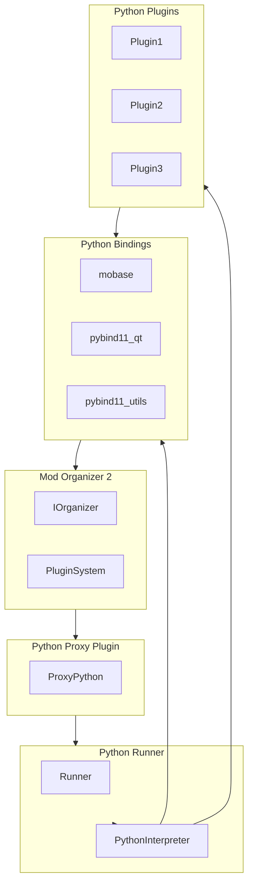
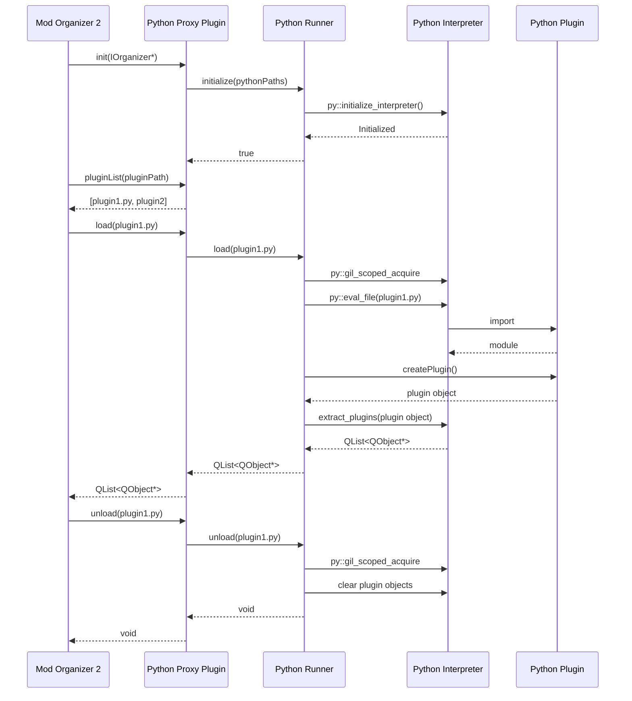
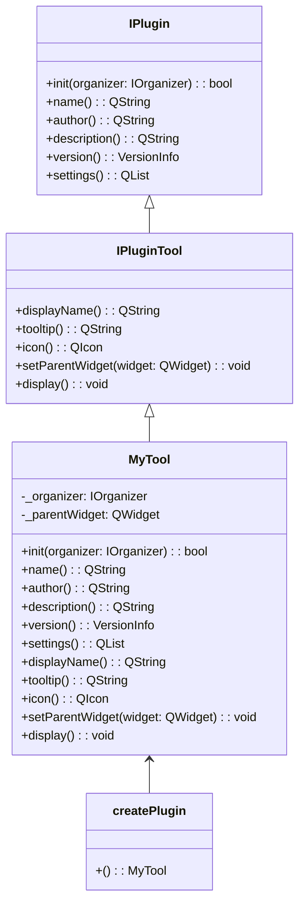
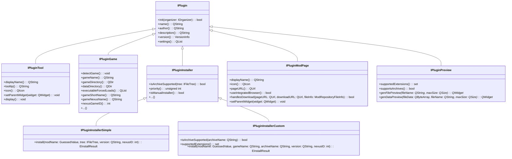
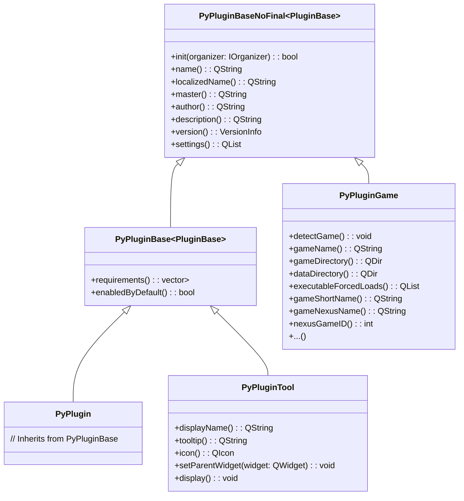
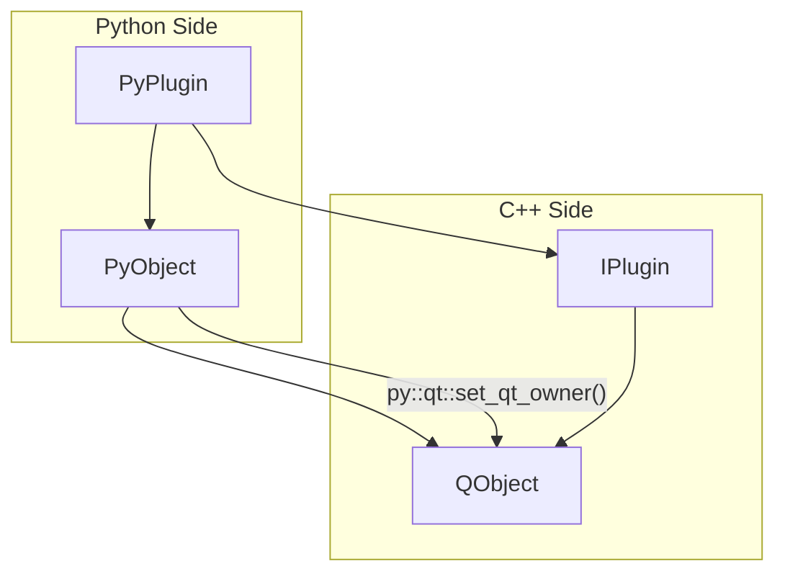

# Mod Organizer 2 Python Plugin System Diagrams

This document provides visual diagrams of the architecture and relationships of the Python plugin system for Mod Organizer 2.

## Table of Contents

- [Mod Organizer 2 Python Plugin System Diagrams](#mod-organizer-2-python-plugin-system-diagrams)
  - [Table of Contents](#table-of-contents)
  - [System Architecture](#system-architecture)
  - [Component Relationships](#component-relationships)
  - [Plugin Loading Sequence](#plugin-loading-sequence)
  - [Python Plugin Structure](#python-plugin-structure)
  - [Plugin Interface Hierarchy](#plugin-interface-hierarchy)
  - [Trampoline Class Hierarchy](#trampoline-class-hierarchy)
  - [Memory Management](#memory-management)

## System Architecture

The following diagram shows the overall architecture of the Python plugin system:



## Component Relationships

The following diagram shows the relationships between the components of the Python plugin system:

```mermaid
classDiagram
    class IPluginProxy {
        +pluginList(pluginPath: QDir): QStringList
        +load(identifier: QString): QList<QObject*>
        +unload(identifier: QString): void
    }
    
    class ProxyPython {
        -m_MOInfo: IOrganizer*
        -m_RunnerLib: HMODULE
        -m_Runner: IPythonRunner*
        -m_LoadFailure: FailureType
        +init(moInfo: IOrganizer*): bool
        +pluginList(pluginPath: QDir): QStringList
        +load(identifier: QString): QList<QObject*>
        +unload(identifier: QString): void
    }
    
    class IPythonRunner {
        +load(identifier: QString): QList<QObject*>
        +unload(identifier: QString): void
        +initialize(pythonPaths: vector<path>): bool
        +addDllSearchPath(dllPath: path): void
        +isInitialized(): bool
    }
    
    class PythonRunner {
        -m_PythonObjects: unordered_map<QString, vector<py::handle>>
        -ensureFolderInPath(folder: QString): void
        +load(identifier: QString): QList<QObject*>
        +unload(identifier: QString): void
        +initialize(pythonPaths: vector<path>): bool
        +addDllSearchPath(dllPath: path): void
        +isInitialized(): bool
    }
    
    IPluginProxy <|-- ProxyPython
    IPythonRunner <|-- PythonRunner
    ProxyPython --> IPythonRunner
```

## Plugin Loading Sequence

The following sequence diagram shows the process of loading a Python plugin:



## Python Plugin Structure

The following diagram shows the structure of a Python plugin:



## Plugin Interface Hierarchy

The following diagram shows the hierarchy of plugin interfaces:



## Trampoline Class Hierarchy

The following diagram shows the hierarchy of trampoline classes:



## Memory Management

The following diagram shows the memory management of Python objects:



These diagrams should help visualize the architecture and relationships of the Python plugin system for Mod Organizer 2.
