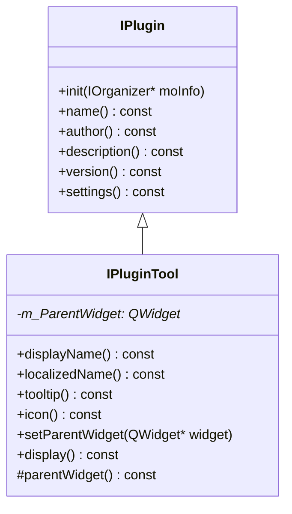
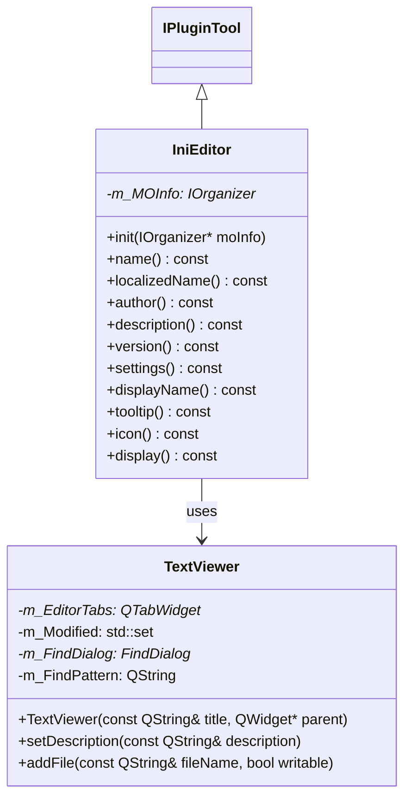
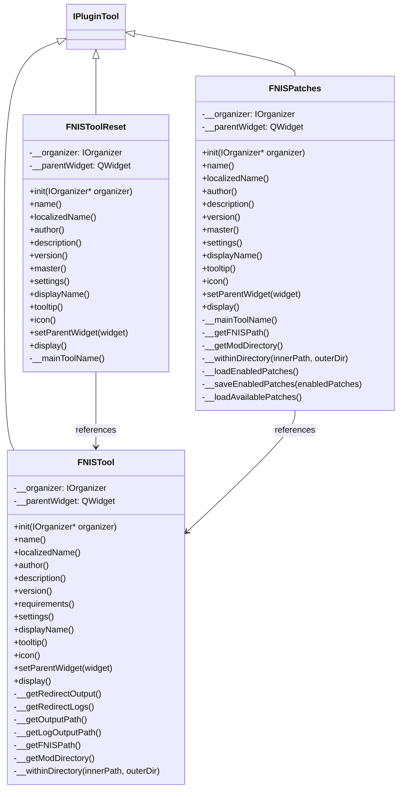
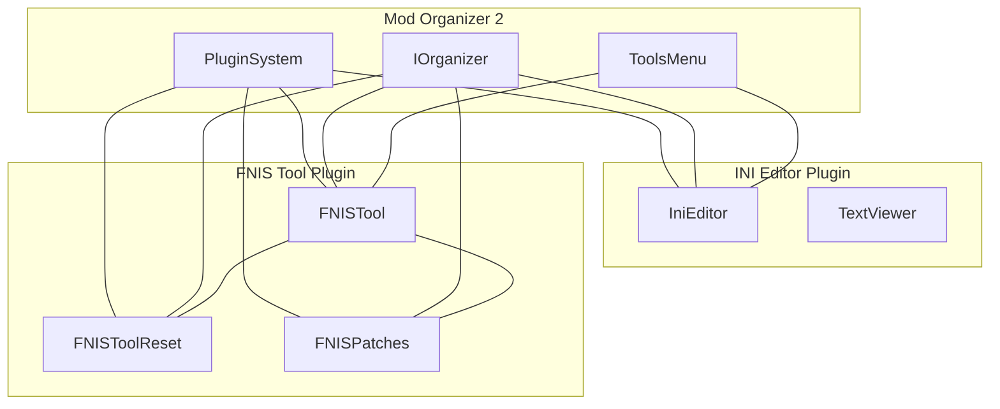
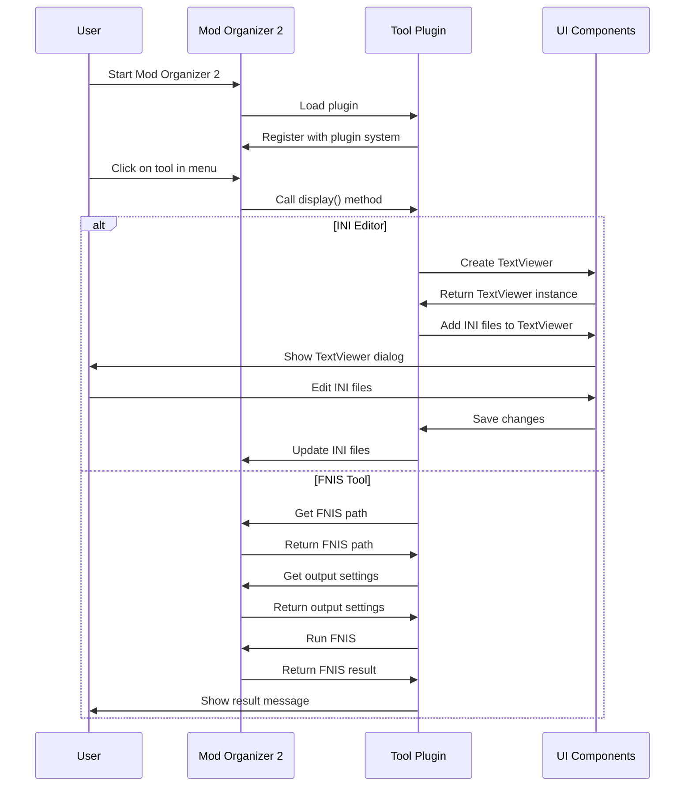

# Mod Organizer 2 Tool Plugins Diagrams

This document provides visual diagrams of the classes and their relationships in the Mod Organizer 2 tool plugins, specifically the INI Editor and FNIS tool plugins.

## Table of Contents

- [Mod Organizer 2 Tool Plugins Diagrams](#mod-organizer-2-tool-plugins-diagrams)
  - [Table of Contents](#table-of-contents)
  - [Plugin Interface Hierarchy](#plugin-interface-hierarchy)
  - [INI Editor Plugin Structure](#ini-editor-plugin-structure)
  - [FNIS Tool Plugin Structure](#fnis-tool-plugin-structure)
  - [Tool Plugin Integration with Mod Organizer 2](#tool-plugin-integration-with-mod-organizer-2)
  - [Tool Plugin Workflow](#tool-plugin-workflow)

## Plugin Interface Hierarchy

The following diagram shows the inheritance hierarchy of the plugin interfaces in Mod Organizer 2:

## INI Editor Plugin Structure

The following diagram shows the structure of the INI Editor plugin:

## FNIS Tool Plugin Structure

The following diagram shows the structure of the FNIS tool plugin:

## Tool Plugin Integration with Mod Organizer 2

The following diagram shows how tool plugins integrate with Mod Organizer 2:

## Tool Plugin Workflow

The following sequence diagram shows the typical workflow of a tool plugin:

These diagrams should help visualize the structure and relationships of the tool plugins in Mod Organizer 2.
