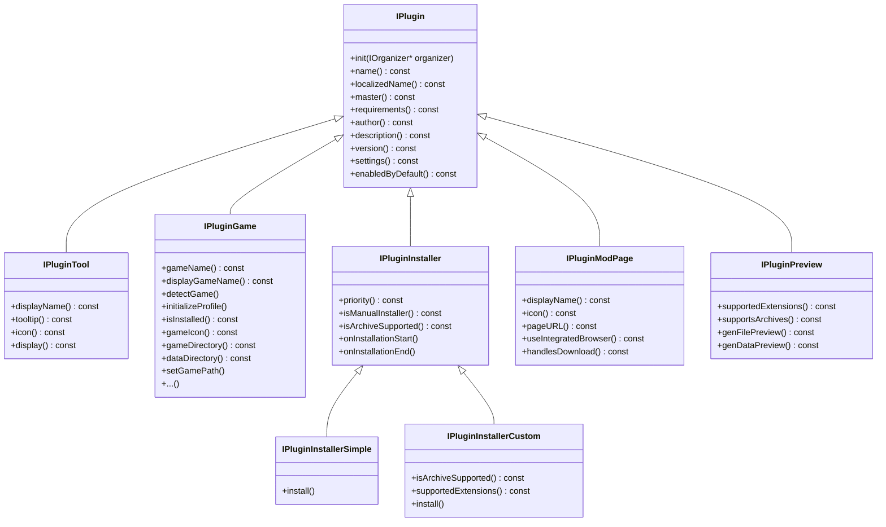
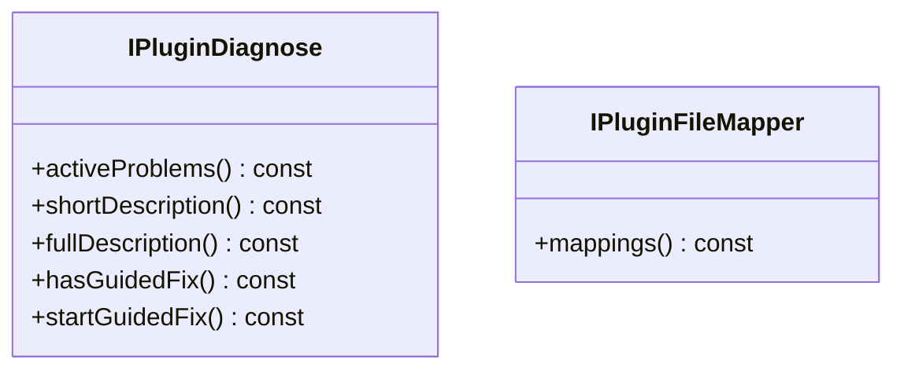
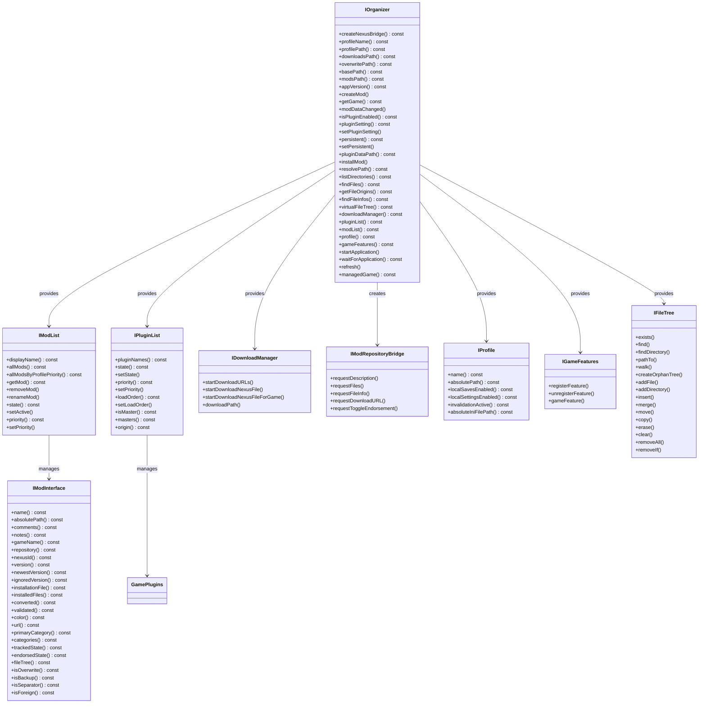
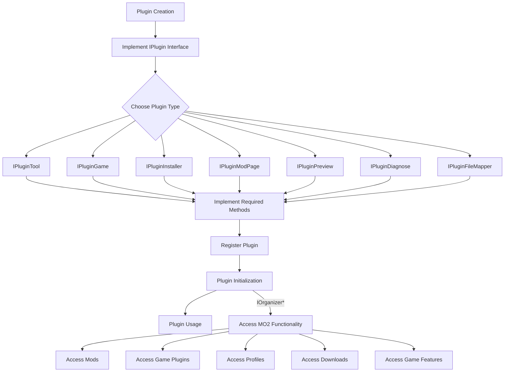
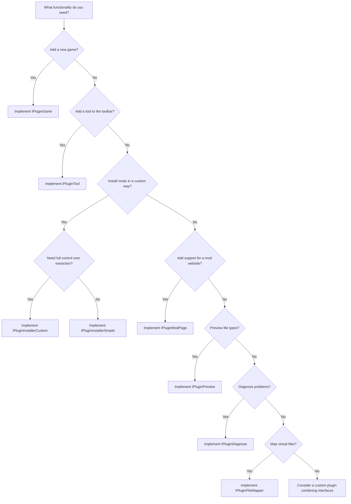

# Mod Organizer 2 UI Base Diagrams

This document provides visual diagrams of the interfaces and classes in the Mod Organizer 2 UI Base library to help understand their relationships.

## Plugin Interface Hierarchy

The following diagram shows the inheritance hierarchy of the plugin interfaces in Mod Organizer 2:

## Additional Plugin Interfaces

Some plugin interfaces don't inherit directly from `IPlugin` to prevent multiple inheritance issues:

## Core Interfaces Relationships

The following diagram shows the relationships between the core interfaces in Mod Organizer 2:

## Game Features Hierarchy

The following diagram shows the game feature interfaces in Mod Organizer 2:

```mermaid
classDiagram
    GameFeature <|-- BSAInvalidation
    GameFeature <|-- DataArchives
    GameFeature <|-- GamePlugins
    GameFeature <|-- LocalSavegames
    GameFeature <|-- ModDataChecker
    GameFeature <|-- ModDataContent
    GameFeature <|-- SaveGameInfo
    GameFeature <|-- ScriptExtender
    GameFeature <|-- UnmanagedMods
    
    class GameFeature {
        +typeInfo() const
    }
    
    class BSAInvalidation {
        +isInvalidationBSA()
        +deactivate()
        +activate()
        +prepareProfile()
    }
    
    class DataArchives {
        +vanillaArchives() const
        +archives() const
        +addArchive()
        +removeArchive()
    }
    
    class GamePlugins {
        +writePluginLists()
        +readPluginLists()
        +getLoadOrder()
        +lightPluginsAreSupported()
        +mediumPluginsAreSupported()
        +blueprintPluginsAreSupported()
    }
    
    class LocalSavegames {
        +mappings() const
        +prepareProfile()
    }
    
    class ModDataChecker {
        +dataLooksValid() const
        +fix() const
    }
    
    class ModDataContent {
        +getAllContents() const
        +getContentsFor() const
    }
    
    class SaveGameInfo {
        +getMissingAssets() const
        +getSaveGameWidget() const
    }
    
    class ScriptExtender {
        +BinaryName() const
        +PluginPath() const
        +loaderName() const
        +loaderPath() const
        +savegameExtension() const
        +isInstalled() const
        +getExtenderVersion() const
        +getArch() const
    }
    
    class UnmanagedMods {
        +mods() const
        +displayName() const
        +referenceFile() const
        +secondaryFiles() const
    }
```

## Plugin Development Flow

The following diagram shows the typical flow of a plugin in Mod Organizer 2:

## Plugin Type Decision Tree

The following diagram helps decide which plugin type to implement based on the desired functionality:

These diagrams should help visualize the relationships between the different interfaces in Mod Organizer 2 and make it easier to understand how to develop plugins for it.
